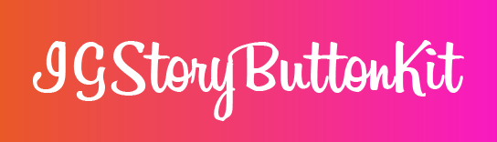

# Introduction
Have you ever seen UI like instagram story, haven't you?
Actually, features like instagram story have been implemented in many applications recently. 

In order to implement these features like instagram story or rich UI quickly, IGStoryButtonKit provides an easy-to-use button so called `IGStoryButton` with rich animation and multiple way inspired by instagram story.

# Usage
## Display Type
IGStoryButton has four display types; `seen`, `unseen`, `status`, `none`. The appearance of IGStoryButton depends on these display types, and the detail is as follows.

||seen|unseen|status|none|
|----|----|----|----|----|
|||||

# Requirements
Swift 5.0+ 
Xcode 11.0+

# Installation
## CocoaPods

## Carthage

## Swift Package Manager

# Contribution
If you find any issue, please let me know on Issues. Also, If you propose and implement new features, please open Pull Requests. 

Let's discuss together to improve that this OSS becomes more convenient for developers!

# Future Work
- [ ] Introduce loading animation with dash line to make current animation richer (High Priority, but it seems difficult)
- [ ] Code refactor

# License
Under MIT
